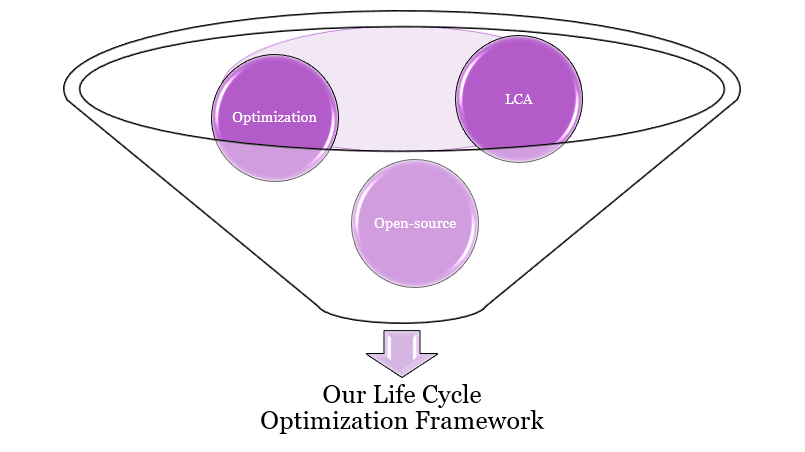
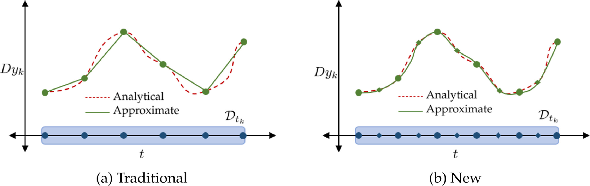

# Life Cycle Optimization

We will combine methods for quantifying environmental burden like <b>life cycle assessments (LCA)</b> and optimization methods like <b>generalized disjunctive programming</b>. We will use these techniques to develop a computational framework that standardizes the integration of LCA into optimization formulations, takes parametric uncertainty into account, and is generalizable to many different applications.

# Dynamic Parameter Estimation

Accurate predictive models are necessary to design sustainable bioprocesses. We are developing a high-throughput optimization framework to systematically identify and evaluate potential models to describe complex biological systems. This framework will also be used for dynamic <b>design-of-experiments</b> to identify the best experiments to train the model to yield the most accurate predictions.

<ul class="actions">
    <li><a href="/research.html#infiniteopt" class="button icon fa-arrow-left">Go back to Research Summaries</a></li>
</ul>