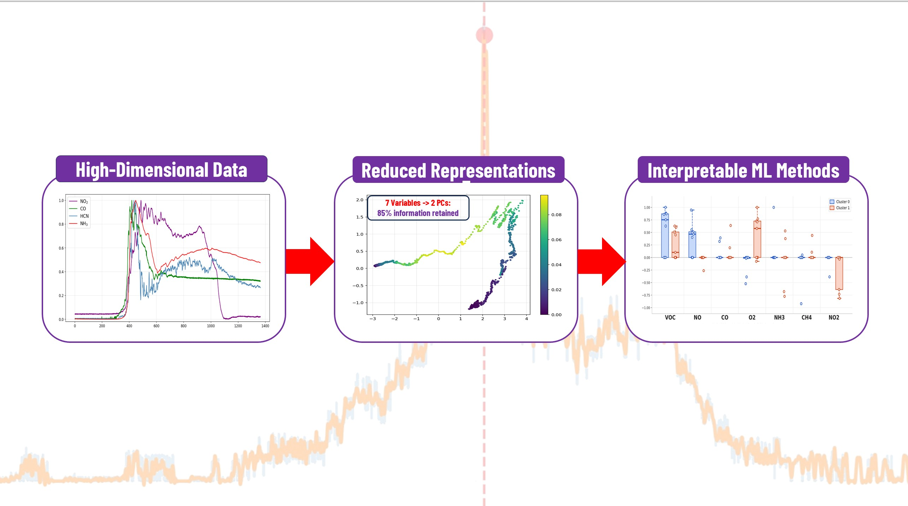

# Background
Modern residential construction has shifted toward highly airtight homes for energy efficiency. This creates oxygen-limited conditions when a fire occurs. Unlike the well-ventilated fires that historical fire codes and research were built around, these under-ventilated fires burn slower and produce significantly more toxic combustion byproducts, posing new hazards that existing tools are not designed to handle. A key challenge in studying these fires is that the most informative physical signal, the mass loss rate (MLR), whose peak marks the precise transition from well-ventilated to under-ventilated combustion, cannot be measured in a real fire. While gas sensors (CO, O₂, NO₂, NH₃, CH₄, VOCs) can be deployed in practice, regime transitions are difficult to identify directly from raw sensor signals because the relevant combustion behavior is embedded within a complex high-dimensional sensor space. 

<!-- # Stefan research -->
<!--  -->

Large-scale fire experiments generate hundreds of simultaneous sensor measurements that are difficult to interpret using conventional analysis. We developed a <b>three-step framework (Initial Screening and Visualization, Time Segmentation, and Targeted Sensor Correlation Analysis)</b> to extract physically meaningful structure from this high-dimensional data. We used <b>PCA</b> to compress 10 sensor measurements into two dimensions retaining 89% of total variance and identified a faulty CO₂ sensor that had exceeded its operational range. Next, <b>k-means clustering</b> identified three distinct fire regimes with the boundaries aligning precisely with the well-ventilated to under-ventilated transition. <b>Sparse regression models</b> were leveraged within each regime to achieve R² values of 0.96, 0.90, and 0.91, compared to 0.59 for a single global model. This demonstrates that accounting for fire regime structure is essential for accurate and interpretable sensor-based characterization.

# Machine Learning methods for Combustion and Decay Analysis

Building on the PCA → K-means → sparse PLS framework we developed for <b>fire regime characterization</b>, we extended the methodology from a single experimental fire test to the complete experimental dataset through the development of an <b>object-oriented programming (OOP)</b> framework that automates <b>preprocessing, clustering, sparse regression,</b> and <b>visualization</b> across all experiments. We also developed a method for comparing fire regimes, enabling direct comparison of regime behavior through the underlying chemical relationships identified by the framework. In parallel, we explored <b>machine learning</b> approaches for fire regime transition detection using deployable gas sensor data, with potential applications in fire modeling, sensing technologies, and operational decision-making for fire responders. 

<ul class="actions">
    <li><a href="/research.html#infiniteopt" class="button icon fa-arrow-left">Go back to Research Summaries</a></li>
</ul>