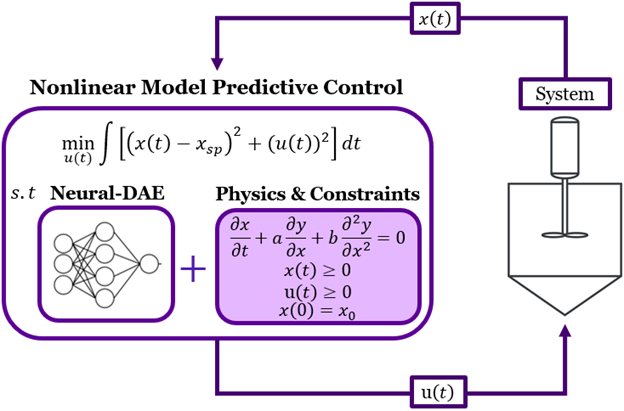

# Background
Engineering processes and systems are shaped by nonlinear dynamics, physical constraints, and phenomena that are difficult to describe fully using first principles. To address these modelling gaps, hybrid physics models and machine learning have emerged as viable methods for predicting system behaviour. However, classic neural networks frequently deviate from underlying physical laws, yielding incorrect or infeasible predictions. These physical inconsistencies make standard models non-ideal for constrained optimization and <b>nonlinear model predictive control (NMPC)</b> frameworks. Our research addresses these issues by developing hard-constrained and physics-guided machine learning methods that enforce physical laws and system constraints during training. Specifically, we focus on <b>hard-constrained physics-informed neural networks</b>, <b>hybrid neural differential algebraic equations</b>, and optimization-based training tailored for control applications.

# Optimal Control with Neural Differential Algebraic Equations

Recent advances in training <b>neural differential algebraic equations</b> (Neural-DAE) allow model parameters to be optimized simultaneously with hard constraints. Yet, these models have not been applied to nonlinear optimal control. Our research implements hard-constrained Neural-DAEs within <b>nonlinear model predictive control</b> frameworks using [InfiniteOpt.jl](https://infiniteopt.github.io/InfiniteOpt.jl/stable/) and GPU-acceleration via [InfiniteExaModels.jl](https://github.com/infiniteopt/InfiniteExaModels.jl) to provide accurate, scalable control of nonlinear dynamic systems. 

<ul class="actions">
    <li><a href="/research.html#surrogates" class="button icon fa-arrow-left">Go back to Research Summaries</a></li>
</ul>